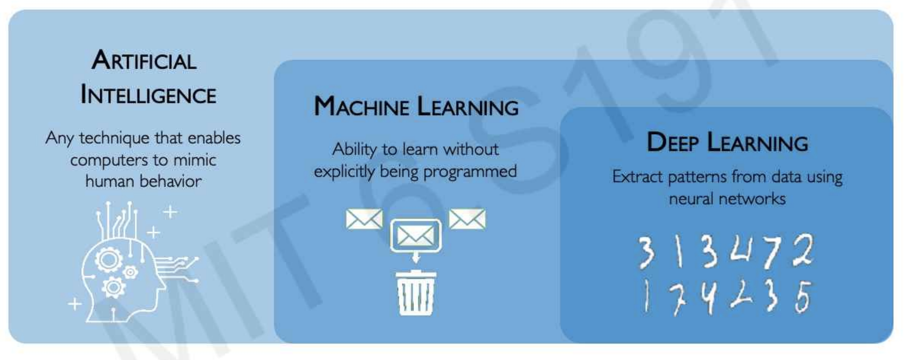

1. AI - Technique that enables computer to mimic human behaviour
2. ML - Ability to learn without explicitly being programmed
3. DL - Extract patterns from data using Neural Networks

## Major libraries
1. Tensorflow from Google
2. Pytorch from Facebook, this is based on [[Torch]]

These are built on [[Tensors]], a mathematical object similar (or amalgamation of) vector and matrix.

## Terminologies

1. Neural Networks
2. Perceptron
3. Forward Propagation
4. Activation function
5. Sigmoid function
6. Hyperbolic tangents
7. Rectified Linear Unit
8. Non-linearity
9. Bias
10. Empirical loss
11. Binary Cross Entropy Loss
12. Mean squared error loss
13. Loss optimization
14. Gradient descent
15. Compacting gradient back propagation
16. Stochastic Gradient Descent

## Reference
1. Intro to Deep learning - [Class of 2026](https://introtodeeplearning.com/slides/6S191_MIT_DeepLearning_L1.pdf).
