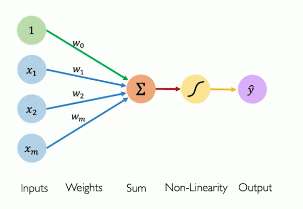
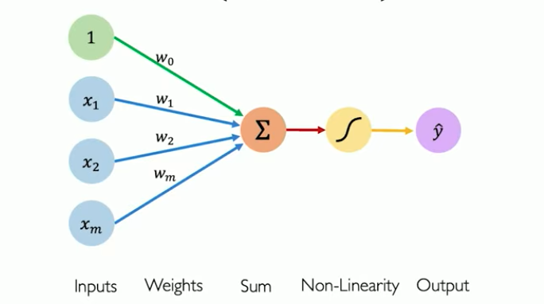
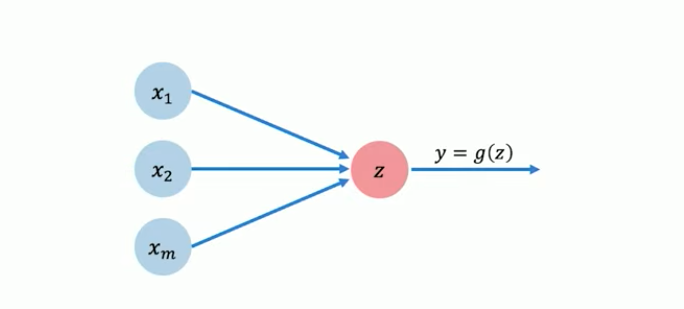
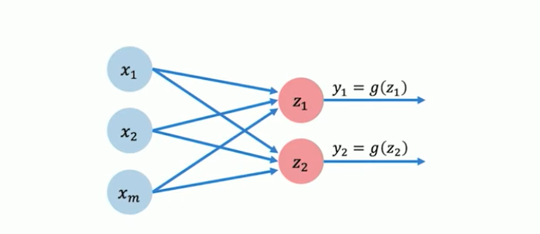
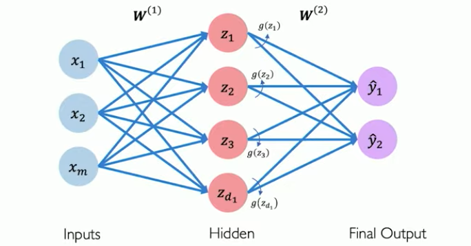
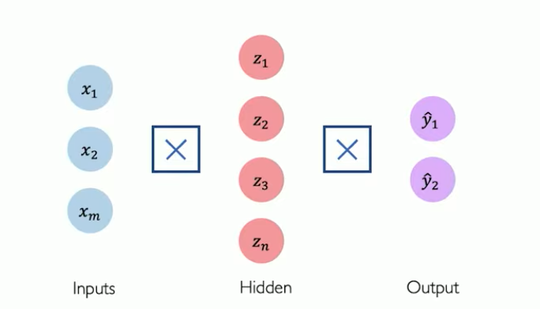
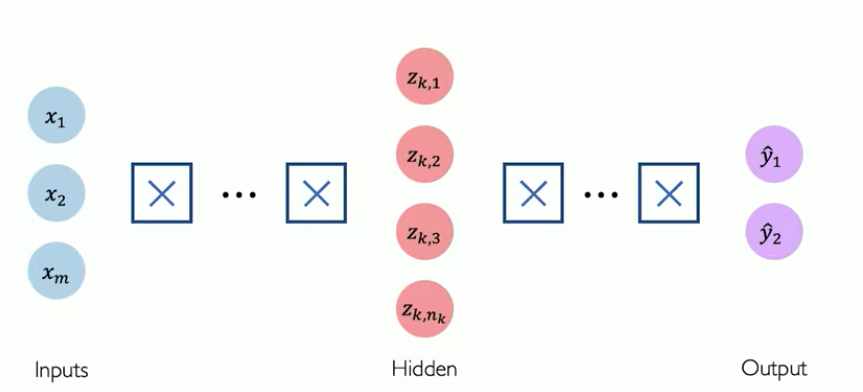

## Perceptron: Forward Propagation

Perceptron is a basic component of Neural network.

$$

 y = g (w_0 + \sum_{i=1}^{m} x_i w_i)
  \newline

  \quad {\ where\   y\ is\ Output,}
  \quad  {g\ is\ non-linear\ activation\ function, }
  \quad { w_0\ is\ bias, }
  \quad {x_i w_i\ is Linear\ Combination\ input    }

$$

### Activation Function

Purpose - To introduce non-linearity into the network.

Examples of Activation Function,
1. Sigmoid function
2. Hyperbolic tangent
3. Rectified Linear Unit

##  Building Neural Networks with Perceptron

### A Single Neuron

When having _m_ number of dimensions, the above equation in Matrix form can be,

$$
 y = g (w_0 + X^T W)
\newline
\quad \\\text{\ where\ } X\ {\ is }
\begin{bmatrix}
x_1 \\ x_2 \\ . \\ . \\ x_m
\end{bmatrix}
\quad {,\ W\ is}
\begin{bmatrix}
w_1 \\ w_2 \\ . \\ . \\ w_m
\end{bmatrix}
$$

> [!Single Neuron]
> It is a _**dot product**_ + _**bias**_ and applying the _**non-linearity**_.

### Perceptron: Simplified

$$
z = w_0   +  \sum_{j=i}^m x_j w_j
$$

Then,

$$
y = g(z)
$$

### Multi Output Perceptron

$$
Z_i = w_{o,i}   +  \sum_{j=i}^m x_j w_{j,i}

$$

> [!Dense Layer]
> In Multi output perceptron the _inputs_ are densely connected to _outputs_ its called **Dense Layer**

### Single Layer Neural Network

Hidden layer is,

$$

z_i = w_{o,i}^{(1)}   +  \sum_{j=i}^m x_j w_{j,i}^{(1)}

$$

Final output is,

$$
y_{i} = g (w_0^{i} + \sum_{i=1}^{d_{1}}  g(z_{j}) w_{i,j}^{(2)})
$$

### Simplifying Multi  Output Perceptron

The connection are simplified, and those are _matrix multiplication_.

## Deep Neural Network

Deep Neural Network a neural network with more than 3 layers.

$$

z_{k,i} = w_{o,i}^{(k)}   +  \sum_{j=i}^{n_{k-1}} g(z_{k-1,j}) x_j w_{j,i}^{(k)}

$$

### Loss
1. **Quantifying Loss** - The loss of our network measures the cost incurred from incorrect predictions.

2. **Binary Cross Entropy Loss** - Can be used with models that output probability between 0 and 1.

3. **Mean Squared Error** - Can be used with models that output continuous real numbers.

## Training Neural Networks

**Loss Optimization** - We want to find the ==network weights== that **achieve lowest loss**. 

### Gradient Descent
**Algorithm** 
1. Initialize  weights randomly $$ N (0, \sigma^2) $$
2. Loop until convergence 
3. Compute Gradient $$ \frac {\partial J(W)}{\partial W} $$ 
4. Update weights $$ W \leftarrow W - \eta \frac {\partial J(W)}{\partial W}  \text{ where\ } \eta \text{\ is } \textbf{Learning Rate}$$
5. Return weights

## Neural Networks in Practise: Optimization

- Loss can be difficult to optimize
- Optimization through gradient descent $$ W \leftarrow W - \eta \frac {\partial J(W)}{\partial W}  \text{ where\ } \eta \text{\ is } \textbf{Learning Rate}$$

**Setting Learning Rate**

- **Small learning rate** converges slowly and get stuck in false local minima.
- **Large learning rate** overshoot, become unstable and diverge.
- **Stable learning rate** converges smoothly and avoid local minima.

### Adaptive Learning rate
1. Learnings are no longer fixed.
2. Can be made larger or smaller based on,
	1. How large gradient is
	2. How fast learning is happening
	3. Size of particular weights
	4. and more

## Neural Networks in Practise: Mini-batches

### Stochastic Gradient Descent

Pick a *random* point and find the gradient.

Gradient calculation -  $$ \frac {\partial J_{i}(W)}{\partial W} $$ 
This is very noisy but easier to calculate.

#### Batches

To have reduce the noise, we can go for mini batches

> [!Batches]
>  Common batch size is 32.
>  But for LLMs the batch size can be *millions*.

#### Algorithm

1. Initialize  weights randomly $$ N (0, \sigma^2) $$
2. Loop until convergence 
	1. Pick a batch size B.
	2. Compute Gradient $$ \frac {\partial J(W)}{\partial W} = \frac {1}{B} \sum_{k=1}^{B} \frac {\partial J_{k}(W)}{\partial W}   $$ 
	3. Update weights $$ W \leftarrow W - \eta \frac {\partial J(W)}{\partial W}  \text{ where\ } \eta \text{\ is } \textbf{Learning Rate}$$
3. Return weights

#### Mini Batches 
1. More accurate estimation of Gradient
2. Smoother convergence
3. Allows for larger  learning rates
4. Mini batches lead to faster trainings
5. Can parallelize computation
	1. Achieve significant speed with increases on GPU's

## Neural Networks in Practise: Overfitting

### Overfitting

Overfitting: Very good at training dataset, but not generalize enough to work on testing dataset.

- Too complex
- Extra parameters
- Does not generalize well

### Regularization

Technique that constrains our optimization problem o discourage complex models.

- Why do we need it?
	- Improve generalization of our model even on unseen data

#### Regularization I : Dropout

1. During training, randomly set some activations to 0
	- Typically 'drop' 50% of activation in the layer
	- Forces Neurons to not rely on any 1 node
	- Increases resiliency
2. Dropout is Architectural level Regularization

#### Regularization I : Early Stopping

1. Stop training before we have a chance to overfit.
2. 

---

## Reference

1. Intro to Deep Learning - [Youtube video ](https://www.youtube.com/watch?v=II4giR4vOOo&list=PLtBw6njQRU-rwp5__7C0oIVt26ZgjG9NI)

