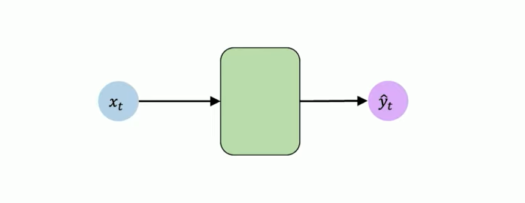
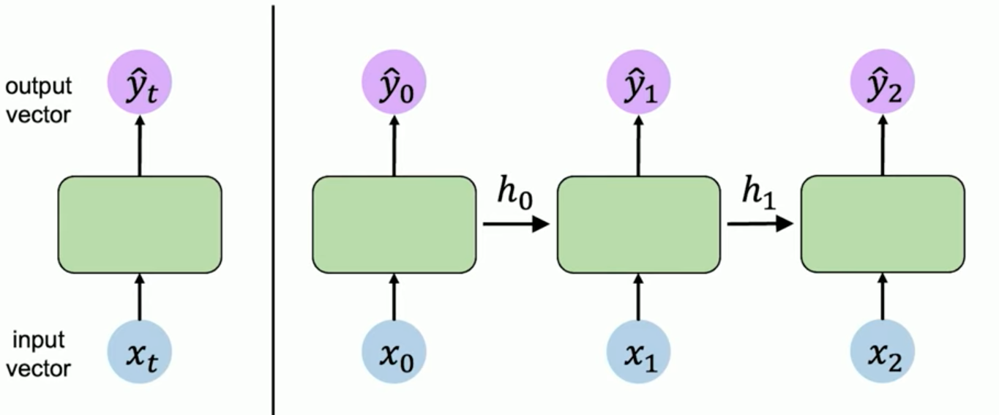
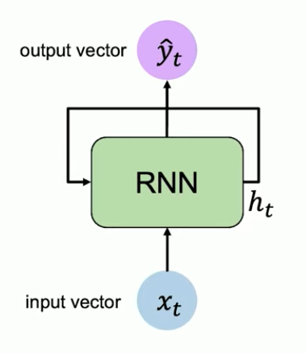
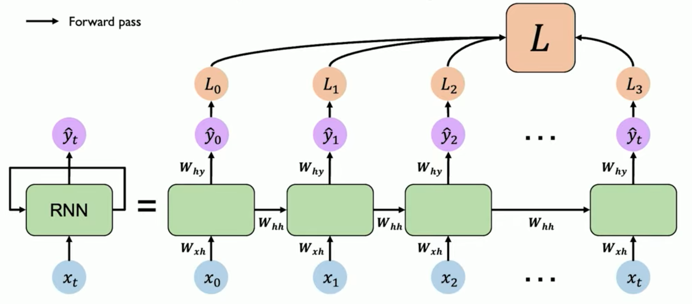

## Feed Forward Networks




 $$ where \  x_{t} \in \mathbb R^{m} \text{\ and \ } \hat{y}_{t} \in \mathbb R^{n}$$

These are individual neurons on time _t_.

## Neurons with Recurrence 



Here, each of the neuron depends on the previous neuron. 

$$ \hat{y} = f(x_{t}, h_{t-1}) \text{ where h is past memory }$$

## Recurrent Neural Networks (RNNs)


- RNNs have a state  h<sub>t</sub>
- h<sub>t</sub> is updated at each time step as sequence is processed
- Applying recurrence relation at every step to process a sequence,

$$ h_{t} = f_{w}( x_{t} , h_{t-1}) $$
$$where \  h_{t}\  is\ cell\ state; \  f_{w} \ is function\ with\ weights;\ x_{t}\ is\ input\ ;\  h_{t-1}\ is\ old\ state     $$

### RNN Intuition - Pseudocode

```
my_rnn = RNN()
hidden_state = [0, 0, 0, 0]

sentence = ["I", "love","Recurrent","Neural"]

for word in sentence:
	prediction, hidden_state = my_rnn(work, hidden_state)
	
next_word_prediction = prediction

```


### RNN State Update & Output

Output vector is defined as ,

$$ \hat{y} = W^{T}_{hy} h_{t} \, here\ W\ is\ weight   $$

Update Hidden state can be calculated as, 

hidden state = activation function (tan hyperbolic) { Weight applied to past state + Weight applied to past state}

$$ h_{t} =  \tanh( W^{T}_{hh} h_{{t-1}} + W^{T}_{xh} x_{t} ) \ where\ x_{t}\ is\ input\ vector $$ 
### RNNs : Computational Graph Across Time

Reuse same weights matrices  at every time step,




## A Sequence Modelling Problem: Predict the Next Word

- Neural networks cannot understand the texts, it should be encoded as numbers.
- *Tokenization* is one of the encoding method
- Embedding: is transforming indexes into  vector of fixed size

### Sequence Modelling Design Criteria

To model sequence we need to,

1. Handle variable length sequence
2. track longterm dependencies
3. Maintain information about order
4. Share parameters across the sequence


## Attention Is All You Need


